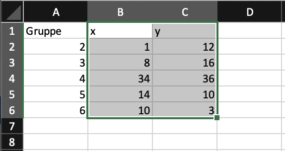
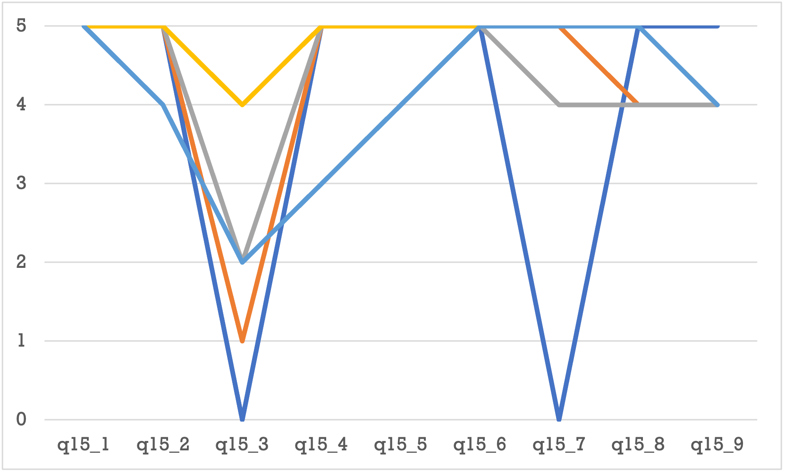

::: {.callout-warning}
## Work in Progress
:::

Daten und Diagramme

## Diagramme erstellen

::: {.callout-warning}
Excels Diagrammtypen erfordern, dass die Daten in einem bestimmten Format vorliegen. Das notwendige Format hängt vom Diagrammtyp ab. Es lassen sich deshalb nicht alle Visualisuerungen aus den gleichen Datenstrukturen erzeugen. 
:::

### Datenvorbereitung

Die verschiedenen Diagrammtypen erfordern unterschiedliche Datenformate. Deshalb müssen die Daten für die Visualisierung vorbereitet und in eine geeignete Form gebarcht werden.

Alle Werte, die visualisiert werden sollen, müssen einen Bereich bilden. Dieser Bereich kann innerhalb einer Tabelle liegen oder dynamische Felder umfassen.

Excel organisiert die Werte für die Darstellung in *Datenreihen*. Je nach Visualisierung besteht eine Datenreihe aus einer Überschrift und einer, zwei oder drei Spalten mit Werten.

::: {.callout-tip}
## Praxis
Es vereinfacht die Arbeit, wenn die Spalten einer Datenreihe möglichst nebeneinander geschrieben werden. Alternativ können die gleichen Teilspalten organisiert werden. Letzteres bietet sich immer dann an, wenn die Werte in die Breitform *transponiert* werden müssen.
:::

Erlaubt ein Diagramm horizontale oder vertikale Achsbeschriftungen, dann werden diese normalerweise in den Spalten *vor* den eigentlichen Werte für den Darstellungsbereicht positioniert. 

### Diagrammerstellung

Um ein Diagramm zu erstellen müssen die vorbereiteten Daten markiert werden. Excel Diagramme können *nicht* mit dynamischen Feldern umgehen, so dass *alle* darzustellenden Werte markiert werden müssen.

Ausser den Spaltenüberschriften sollten keine weiteren Daten markiert werden. Dazu gehören auch die Werte, die für die Beschriftung der X-Achse benötigt werden. @fig-diagramme-werte-markieren zeigt eine solche Markierung.

{#fig-diagramme-werte-markieren}

::: {.callout-important}
## Achtung
Oft liegen Daten als Tabellen oder Dynamische Felder vor. Verändert sich die Anzahl der Werte einer solchen Datenstruktur, betrifft diese Änderung **nicht** den markierten Wertebereich. Liegen neue Werte ausserhalb des markierten Bereichs für ein Diagramm, dann werden diese Werte nicht dargestellt. In solchen Fällen muss der Bereich für die Darstellung nachträglich erweitert werden.
:::

Nachdem wie zu visualisierenden Werte markiert wurden, kann das eigentliche Diagramm eingefügt werden. Dazu muss aus dem Menübalken `Einfügen` im Abschnitt `Diagramme` (@fig-menu-diagramme) die gewünschte Darstellung ausgewählt werden.

{#fig-menu-diagramme}

Die Auswahl erzeugt das gewünschte Diagramm für die markierten Daten auf dem aktuellen Arbeitsblatt.

### Diagrammbearbeitung

Sobald ein Diagramm erstellt wurde, kann es über das Menüband `Diagrammentwurf` angepasst werden. Dieses Menüband wird nur angezeigt, wenn ein Diagramm ausgewählt wurde.

{#fig-menu-diagrammentwurf}

::: {.callout-tip}
## Praxis
Für die Datenvisualisierung sind das Untermenü `Diagrammelement hinzufügen` und das Kommando `Daten markieren` zentral, weil über sie die Darstellung gesteuert wird. 

Daneben wird das Farbschema über das Menü `Farben ändern` gesteuert.
:::

Das Untermenu `Diagrammelement hinzufügen` erlaubt es, einzelne Diagrammelement zur Visualisierung hinzuzufügen **oder zu entfernen**. Die möglichen Diagrammelemente hängen vom jeweiligen Diagrammtyp ab. 

Das Untermenu `Schnelllayout` bietet Vorlagen für die einzelnen Diagrammelemente. Diese Vorlagen dienen oft als Basis für die weitere Verfeinerung mit dem Untermenü `Diagrammelement hinzufügen`. 

Mit dem Untermenü `Farbenändern` können die im Diagramm verwendeten Farben angepasst werden. In diesem Menü finden sich verschiedene Farbpaletten. Diese Farbpaletten werden durch das aktuelle Farbschema der Arbeitsmappe bestimmt.

Im Bereich `Diagrammformatvorlagen` kann die allgemeine Darstellung angepasst werden. Diese Einstellungen sollten nur angepasst werden, um ein Diagramm für eine besondere Präsentation vorzubereiten. Normalerweise werden über diesen Bereich keine Änderungen vorgenommen. 

Das Kommando `Zeile/Spalte tauschen` ist bei guter Vorbereitung der Daten nicht notwendig. Dieses Kommando ändert für eine Visualisierung die Verwendung von Spalten in die Verwendung von Zeilen. Dieses Kommando ist entsprechend nur Notwendig, wenn die Daten zeilenweise anstatt spaltenweise vorbereitet wurden.

::: {.callout-warning}
Manche Visualisierungen verwenden ein komplexes internes Datenmodell, so dass die mehrfache Anwendung des Kommandos `Zeile/Spalte tauschen` nicht zwingend zur urspünglichen Darstellung führt. 
::: 

Mit `Daten markieren` werden die Datenreihen und Quellen für Achsbeschriftungen in der Arbeitsmappe festgelegt. Dieses Kommando öffnet den Dialog `Datenquelle auswählen`, mit dem die Daten den einzelnen Darstellungselementen zugewiesen werden. Mit diesem Kommando können die Datenreihen korrigiert werden, wenn die automatische Erkennung von Excel nicht das gewünschte Ergebnis erzielt hat.

Das Untermenü `Diagrammtyp ändern` erlaubt es, den Typ eines Diagramms zu verändern, ohne den Diagrammbereich zu verändern. Weil die verschiedenen Diagrammtyp recht unterschiedliche Anforderungen an die Datenorganisation haben, sollte hier nur Diagrammtypen innerhalb der gleichen Gruppe ausgewählt werden. Beispielsweise könnte so ein Balkendiagramm in ein Säulendiagramm geändert werden. 

Das Kommand `Diagramm verschieben` erlaubt es, ein Diagramm auf einem eigenen Arbeitsblatt zu platzieren. Dieses Kommando ist nur dann sinnvoll, wenn eine Arbeitsmappe zur Präsentation der Daten verwendet wird. 

### Dialog `Datenquelle auswählen`

Über das Kommando `Daten markieren` wird der Dialog `Datenquelle auswählen` (@fig-dialog-daten-markieren) geöffnet, über den die Daten den Darstellungselementen zugewiesen werden.

{#fig-dialog-daten-markieren}

Der Dialog besteht aus drei Teilen: 

- Der Teil `Bereichdetails` zeigt den Datenbereich des Diagramms an. Der angezeigte Bereich sollte **nicht** in diesem Teil verändert werden.
- Der Teil `Legendeneinträge (Reihen)` weist Spalten mit Werten den Datenreihen des Diagramms zu. In diesem Teil werden die verwendeten Datenbereiche angepasst, die im Teil `Bereichdetails` zusammengefasst angezeigt werden. 
- Im Teil `Ausgeblendete und leere Zellen` wird die Behandlung von leeren Zellen und `#NA`-Werten festgelegt. In diesem Teil sind nur selten Anpassungen notwendig.

### Diagramme exportieren

Um ein Diagramm zum Einbetten in andere Programme bereitzustellen, muss das Diagramm aus Excel exportiert werden. Dazu ein Rechtsklick auf das Diagramm öffnet ein *Kontextmenü*, in welchem sich der Punkt `Als Grafik speichern ...` findet (@fig-diagramm-exportieren). 

::: {.callout-warning}
## MacOS vs. Windows

Das Kommando zum Speichern von Diagrammen heisst unter MacOS `Als Bild speichern ...` und unter Windows `Als Grafik speichern ...`.
::: 

{#fig-diagramm-exportieren}

Anschliessend erscheint ein Dialog zum Speichern der Diagrammdatei (@fig-diagramm-speichern-unter). Standardmässig bietet dieser Dialog als `Dateityp` das Grafikformat `PNG` an, was in den meisten Fällen gewählt werden sollte. Alternativ können Diagramme in den Formaten `JPEG`, `GIF`, `PDF`, `BMP` und `SVG` exportiert werden. Hier sind für die Praxis nur die beiden Formate `PDF` und `SVG` von Bedeutung.

::: {.callout-tip}
## Praxis
Das `PDF`-Format sollte gewählt werden, wenn eine Grafik einzeln ausgedruckt werden soll. 
:::

::: {.callout-tip}
## Praxis
Das `SVG`-Format sollte gewählt werden, wenn das Diagramme grossformtig oder in hoher Qualität auf Web-Seiten veröffentlicht werden soll.
:::

{#fig-diagramm-speichern-unter}

## Diagrammtypen

Alle Excel Diagramme visualisieren Werte vom Datentyp **Zahl**. Um andere Datentypen zu visualisieren, müssen diese zuerst in Zahlen kodiert werden. 

### Balkendiagramme 

Excel unterscheidet zwischen Balken- oder Säulendiagrammen. Technisch unterscheiden sich die beiden Diagrammtype nur durch die Orientierung der Balken. Im Folgenden werden beide Diagrammtypen als Balkendiagramme bezeichnet. 

::: {.callout-note}
## Merke
Für ein  Balkendiagramm entspricht ein Wert einem Balken und der Wert bestimmt dessen Grösse. 
:::

::: {.callout-note}
## Merke
Für Balkendiagramme mit zwei oder mehr Gruppen, **müssen** die Daten in der *Breitform* vorliegen.
:::

Excel bietet zwei spezielle Formen von Balkendiagrammen: *Trichterdiagramme* und *Wasserfall*-Diagramme. Beide Diagramme sind *eindimensional*. 

Trichterdiagramme stellen die Balken horizontal zentriert dar, wobei nur positive Werte zulässig sind. Deshalb haben Excels Trichterdiagramme *keine* Beschriftung der X-Achse (@fig-trichterdiagramm).

::: {.callout-note}
## Merke
Trichterdiagramme unterscheiden sich von anderen Balkendiagrammen nur in der Anordnung der Balken.
:::

{#fig-trichterdiagramm}

::: {.callout-tip}
## Praxis
Weil Trichterdiagrammen keine beschriftete X-Achse haben und die Anordnung der Balken schwerer zu dekodieren ist, sollten diese Diagramme **nicht** verwendet werden.
:::

Wasserfalldiagramme stellen die Balken so dar als Folge dar. Diese Diagramme stellen positive und negative Werte gerichtet nebeneinander. Der Start des von links nach rechts gelesenene nächste Balken beginnt bei dem Wert, an dem der vorherige Balken endete. Bei positiven Werten befindet sich der Endpunkt über dem Startpunkt, bei negativen Werten darunter (@fig-wasserfall-leserichtungen). 

{#fig-wasserfall-leserichtungen}

::: {.callout-note}
## Merke
Wasserfalldiagramme werden zur Visualisierung von Veränderungen über die Zeit verwendet.
:::

Bei Wasserfalldiagrammen kann die **Beschriftung** der X-Achse über ein zweite Datenspalte mitgegeben werden. Bei Trichterdiagrammen können auf die gleiche Weise die Beschriftungen der Y-Achse angepasst werden. In beiden Fällen müssen die Beschriftungen in der Spalte *vor* den Werten gespeichert sein.

### Histogramm

Ein Histogramm ist in Excel **immer** ein eindimensionales Balkendiagramm. Werden Werte aus mehreren Spalten übergeben, dann werden alle Werte im Histogramm abgebildet. 

::: {.callout-tip}
## Praxis
Für Daten mit diskreten Wertebereichen, sind Balkendiagramme **immer** einem Histogramm vorzuziehen.
:::

### Boxplot

### Punktdiagramm

### Blasendiagramm

Blasendiagramme ähneln Punktdiagrammen. Weil drei Merkmale kodiert werden, müssen die Daten in drei Spalten vorliegen. Dabei wird die linke Spalte für die X-Achse verwendet. Die mittlere Spalte wird für die Y-Achse verwendet. Die rechte Spalte enthält die Werte für die Grösse der Punkte. Prinzipiell lassen sich die Werte nachträglich noch umorganisieren, oft ist es aber einfacher, die Spalten vorher anzuordnen.  

{#fig-bubble-chart}

Eine Datenreihe eines Blasendiagramms besteht aus drei Merkmalen.

{#fig-datenreihen-bubble-chart}

### Linien-, Kreis- und Donutdiagramme 

Linien-, Kreis- und Donutdiagramme sind in Excel Varianten von Balkendiagrammen: Sie verwenden das gleiche Format für die Datenreihen und werden ansonsten gleich konfiguriert. Wie bei Balkendiagrammen, wird die X-Achse als eine diskrete Datenskalierung behandelt. Die Daten können also nominal- oder ordinalskaliert sein. 

::: {.callout-tip}
## Praxis

Kreis- und Donutdiagramme sind identisch mit Balkendiagrammen, wenn alle Werte **positiv** sind. Für mehr als drei Werte können die meisten Menschen sich diese Diagramme oft nicht richtig interpretieren. Deshalb sollten Kreis- und Donutdiagramme möglichst nur zur Darstellung (extremer) Mengenverhältinisse verwendet werden. Grundsätzlich ist ein Balkendiagramm einem Kreis- oder Donutdiagramm vorzuziehen. (s. @fig-kreisdiagramm-aehnliche-groessen und @fig-balken-aus-kreisdiagramm)
:::

{#fig-kreisdiagramm-aehnliche-groessen}

{#fig-balken-aus-kreisdiagramm}

Excels **Liniendiagramme** zeichnen für jeden Wert auf der Y-Achse einen Punkt und verbinden die Punkte mit geraden Linien.

::: {.callout-warning}
## Achtung
Weil die X-Achse immer diskrete Daten abbildet, dürfen Liniendiagramme nicht mit Punktdiagrammen mit *interpolierten Linien* verwechselt werden. 
:::

::: {.callout-tip}
## Praxis
Excels Liniendiagramme sollten nur für sog. Paralleldiagramme verwendet werden, in denen mehrere diskrete Merkmale mit dem gleichen Wertebereich gegenübergestellt werden. Durch die Linien werden Unterschiede in den Ausprägungsprofilen sichtbar. 

@fig-parallel-plot zeigt ein solches Paralleldiagramm. Dieses Beispiel macht die Grenzen dieses Diagrammtyps sichbar, weil Excel sich überlagernde Linien nicht nebeneinander darstellen kann. 
:::

{#fig-parallel-plot}

<!--
### Treemap-Diagramme
-->

## Mathematische Funktionen visualisieren

