::: {.callout-warning}
## Work in Progress
:::

## Diagramme erstellen

::: {.callout-warning}
Excels Diagrammtypen erfordern, dass die Daten in einem bestimmten Format vorliegen. Das notwendige Format hängt vom Diagrammtyp ab. Es lassen sich deshalb nicht alle Visualisuerungen aus den gleichen Datenstrukturen erzeugen. 
:::

### Datenvorbereitung

Die verschiedenen Diagrammtypen erfordern unterschiedliche Datenformate. Deshalb müssen die Daten für die Visualisierung vorbereitet und in eine geeignete Form gebarcht werden.

Alle Werte, die visualisiert werden sollen, müssen einen Bereich bilden. Dieser Bereich kann innerhalb einer Tabelle liegen oder dynamische Felder umfassen.

Excel organisiert die Werte für die Darstellung in *Datenreihen*. Je nach Visualisierung besteht eine Datenreihe aus einer Überschrift und einer, zwei oder drei Spalten mit Werten.

::: {.callout-tip}
## Praxis
Es vereinfacht die Arbeit, wenn die Spalten einer Datenreihe möglichst nebeneinander geschrieben werden. Alternativ können die gleichen Teilspalten organisiert werden. Letzteres bietet sich immer dann an, wenn die Werte in die Breitform *transponiert* werden müssen.
:::

Erlaubt ein Diagramm horizontale oder vertikale Achsbeschriftungen, dann werden diese normalerweise in den Spalten *vor* den eigentlichen Werte für den Darstellungsbereicht positioniert. 

### Diagrammerstellung

Um ein Diagramm zu erstellen müssen die vorbereiteten Daten markiert werden. Excel Diagramme können *nicht* mit dynamischen Feldern umgehen, so dass *alle* darzustellenden Werte markiert werden müssen.

Ausser den Spaltenüberschriften sollten keine weiteren Daten markiert werden. Dazu gehören auch die Werte, die für die Beschriftung der X-Achse benötigt werden. @fig-diagramme-werte-markieren zeigt eine solche Markierung.

{#fig-diagramme-werte-markieren}

::: {.callout-important}
## Achtung
Oft liegen Daten als Tabellen oder Dynamische Felder vor. Verändert sich die Anzahl der Werte einer solchen Datenstruktur, betrifft diese Änderung **nicht** den markierten Wertebereich. Liegen neue Werte ausserhalb des markierten Bereichs für ein Diagramm, dann werden diese Werte nicht dargestellt. In solchen Fällen muss der Bereich für die Darstellung nachträglich erweitert werden.
:::

Nachdem wie zu visualisierenden Werte markiert wurden, kann das eigentliche Diagramm eingefügt werden. Dazu muss aus dem Menübalken `Einfügen` im Abschnitt `Diagramme` (@fig-menu-diagramme) die gewünschte Darstellung ausgewählt werden.

{#fig-menu-diagramme}

Die Auswahl erzeugt das gewünschte Diagramm für die markierten Daten auf dem aktuellen Arbeitsblatt.

### Diagrammbearbeitung

Sobald ein Diagramm erstellt wurde, kann es über das Menüband `Diagrammentwurf` angepasst werden. Dieses Menüband wird nur angezeigt, wenn ein Diagramm ausgewählt wurde.

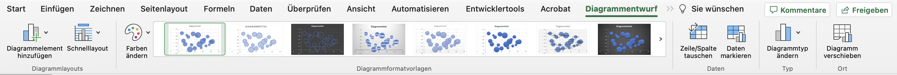{#fig-menu-diagrammentwurf}

::: {.callout-tip}
## Praxis
Für die Datenvisualisierung sind das Untermenü `Diagrammelement hinzufügen` und das Kommando `Daten markieren` zentral, weil über sie die Darstellung gesteuert wird. 

Daneben wird das Farbschema über das Menü `Farben ändern` gesteuert.
:::

Das Untermenu `Diagrammelement hinzufügen` erlaubt es, einzelne Diagrammelement zur Visualisierung hinzuzufügen **oder zu entfernen**. Die möglichen Diagrammelemente hängen vom jeweiligen Diagrammtyp ab. 

Das Untermenu `Schnelllayout` bietet Vorlagen für die einzelnen Diagrammelemente. Diese Vorlagen dienen oft als Basis für die weitere Verfeinerung mit dem Untermenü `Diagrammelement hinzufügen`. 

Mit dem Untermenü `Farbenändern` können die im Diagramm verwendeten Farben angepasst werden. In diesem Menü finden sich verschiedene Farbpaletten. Diese Farbpaletten werden durch das aktuelle Farbschema der Arbeitsmappe bestimmt.

Im Bereich `Diagrammformatvorlagen` kann die allgemeine Darstellung angepasst werden. Diese Einstellungen sollten nur angepasst werden, um ein Diagramm für eine besondere Präsentation vorzubereiten. Normalerweise werden über diesen Bereich keine Änderungen vorgenommen. 

Das Kommando `Zeile/Spalte tauschen` ist bei guter Vorbereitung der Daten nicht notwendig. Dieses Kommando ändert für eine Visualisierung die Verwendung von Spalten in die Verwendung von Zeilen. Dieses Kommando ist entsprechend nur Notwendig, wenn die Daten zeilenweise anstatt spaltenweise vorbereitet wurden.

::: {.callout-warning}
Manche Visualisierungen verwenden ein komplexes internes Datenmodell, so dass die mehrfache Anwendung des Kommandos `Zeile/Spalte tauschen` nicht zwingend zur urspünglichen Darstellung führt. 
::: 

Mit `Daten markieren` werden die Datenreihen und Quellen für Achsbeschriftungen in der Arbeitsmappe festgelegt. Dieses Kommando öffnet den Dialog `Datenquelle auswählen`, mit dem die Daten den einzelnen Darstellungselementen zugewiesen werden. Mit diesem Kommando können die Datenreihen korrigiert werden, wenn die automatische Erkennung von Excel nicht das gewünschte Ergebnis erzielt hat.

Das Untermenü `Diagrammtyp ändern` erlaubt es, den Typ eines Diagramms zu verändern, ohne den Diagrammbereich zu verändern. Weil die verschiedenen Diagrammtyp recht unterschiedliche Anforderungen an die Datenorganisation haben, sollte hier nur Diagrammtypen innerhalb der gleichen Gruppe ausgewählt werden. Beispielsweise könnte so ein Balkendiagramm in ein Säulendiagramm geändert werden. 

Das Kommand `Diagramm verschieben` erlaubt es, ein Diagramm auf einem eigenen Arbeitsblatt zu platzieren. Dieses Kommando ist nur dann sinnvoll, wenn eine Arbeitsmappe zur Präsentation der Daten verwendet wird. 

### Dialog `Datenquelle auswählen`

Über das Kommando `Daten markieren` wird der Dialog `Datenquelle auswählen` (@fig-dialog-daten-markieren-windows) geöffnet, über den die Daten den Darstellungselementen zugewiesen werden.

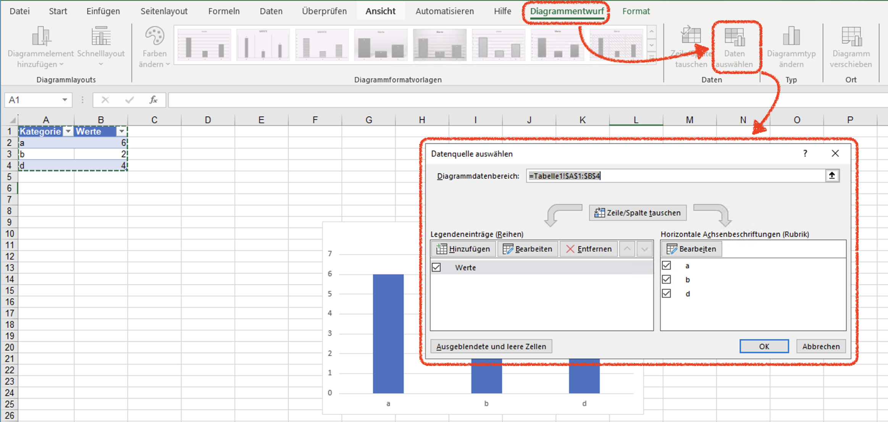{#fig-dialog-daten-markieren-windows}

Durch einen Doppelklick auf eine Datenreihe öffnet sich ein zweiter Dialog, um eine Datenreihe zu konfigurieren (@fig-datenreihe-konfigurieren-windows). Über diesen Dialog sollten die Datenreihen konfiguriert werden, damit sicher gestellt wird, dass die Datenreihen auf die richtigen Werte verweisen.

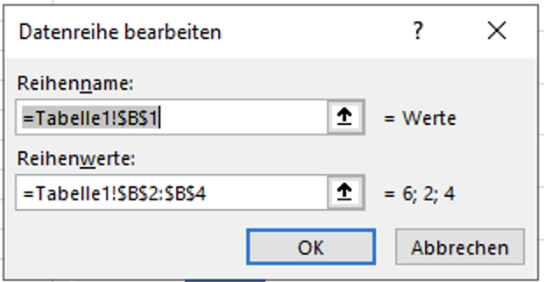{#fig-datenreihe-konfigurieren-windows}

::: {.callout-warning}
## MacOs vs. Windows

Unter MacOS ist die gleiche Funktion etwas anders angeordnet. 

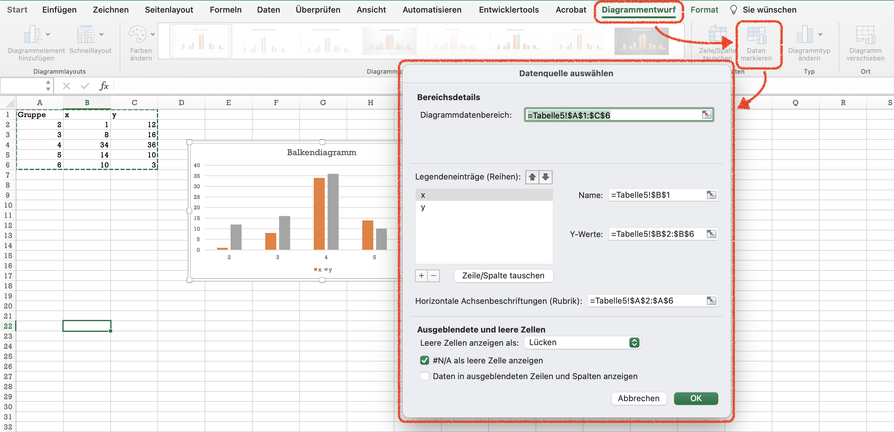{#fig-dialog-daten-markieren-macos}

Der Dialog besteht aus drei Teilen: 

- Der Teil `Bereichdetails` zeigt den Datenbereich des Diagramms an. Der angezeigte Bereich sollte **nicht** in diesem Teil verändert werden.
- Der Teil `Legendeneinträge (Reihen)` weist Spalten mit Werten den Datenreihen des Diagramms zu. In diesem Teil werden die verwendeten Datenbereiche angepasst, die im Teil `Bereichdetails` zusammengefasst angezeigt werden. 
- Im Teil `Ausgeblendete und leere Zellen` wird die Behandlung von leeren Zellen und `#NA`-Werten festgelegt. In diesem Teil sind nur selten Anpassungen notwendig.
:::

### Diagramme formatieren

Die Darstellungselemente von Diagrammen können über den **Formatierungsbereich** angepasst werden. Über den Formatierungsbereich lassen sich die alle Details eines Diagramms anpassen. 

::: {.callout-warning}
## MacOs vs. Windows

Zur Formatierung der Datenreihen wird der Formatierungsbereich benötigt. Dieser wird unter Windows über das Kommando `Auswahl formatieren` geöffnet. Die wichtigsten Formatierungen sind die Datenreihenformatierungen. Je nach Diagrammtyp lassen sich in dieser Rubrik Formatierungen in Abhängigkeit zu den abgebildeten Daten justieren.

{#fig-formatierungsbereich-windows}

Unter MacOS wird der Formatierungsbereich über das Kommando `Formatierungsbereich` im Menüband `Format` geöffnet.

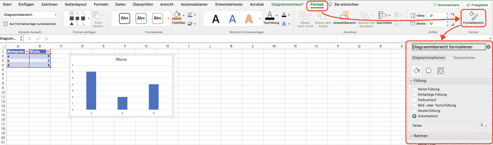{#fig-formatierungsbereich-macos}

Nach dem Öffnen des Formatierungsbereichs können die einzelnen Darstellungselemente gezielt formatiert werden. Immer wenn ein Darstellungselement sich auf Datenreihen bezieht, lassen sich zuätzliche Formatierungen unter der Rubrik `Reihenoptionen` konfigurieren. Diese Optionen werden unter MacOs und Windows leicht unterschiedlich dargestellt (@fig-formatierungsbereich-datenreihen)

::: {#fig-formatierungsbereich-datenreihen layout-ncol=2 layout-valign="bottom"}

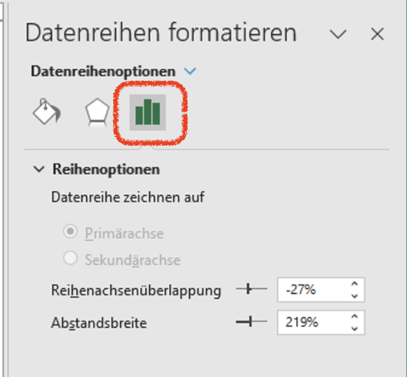{#fig-formatierungs_data-macos}

{#fig-formatierungs_data-macos}

Datenreihen formatieren
:::
:::


### Diagramme exportieren

Um ein Diagramm zum Einbetten in andere Programme bereitzustellen, muss das Diagramm aus Excel exportiert werden. Dazu ein Rechtsklick auf das Diagramm öffnet ein *Kontextmenü*, in welchem sich der Punkt `Als Grafik speichern ...` findet (@fig-diagramm-exportieren). 

::: {.callout-warning}
## MacOS vs. Windows

Das Kommando zum Speichern von Diagrammen heisst unter MacOS `Als Bild speichern ...` und unter Windows `Als Grafik speichern ...`.
::: 

{#fig-diagramm-exportieren}

Anschliessend erscheint ein Dialog zum Speichern der Diagrammdatei (@fig-diagramm-speichern-unter). Standardmässig bietet dieser Dialog als `Dateityp` das Grafikformat `PNG` an, was in den meisten Fällen gewählt werden sollte. Alternativ können Diagramme in den Formaten `JPEG`, `GIF`, `PDF`, `BMP` und `SVG` exportiert werden. Hier sind für die Praxis nur die beiden Formate `PDF` und `SVG` von Bedeutung.

::: {.callout-tip}
## Praxis
Das `PDF`-Format sollte gewählt werden, wenn eine Grafik einzeln ausgedruckt werden soll. 
:::

::: {.callout-tip}
## Praxis
Das `SVG`-Format sollte gewählt werden, wenn das Diagramme grossformtig oder in hoher Qualität auf Web-Seiten veröffentlicht werden soll.
:::

{#fig-diagramm-speichern-unter}


## Diagrammtypen

Alle Excel Diagramme visualisieren Werte vom Datentyp **Zahl**. Um andere Datentypen zu visualisieren, müssen diese zuerst in Zahlen kodiert werden. 

### Balkendiagramme 

Excel unterscheidet zwischen Balken- oder Säulendiagrammen. Technisch unterscheiden sich die beiden Diagrammtype nur durch die Orientierung der Balken. Im Folgenden werden beide Diagrammtypen als Balkendiagramme bezeichnet. 

::: {.callout-note}
## Merke
Für ein  Balkendiagramm entspricht jeder Wert einem Balken und der Wert bestimmt dessen Grösse. 
:::

Die Anzahl der Werte entspricht der Anzahl der Balken. Daraus folgt, dass ein Balkendiagramm immmer diskrete Daten auf der X- und Zahlenwerte auf der Y-Achse abbildet.

Balkendiagramme können keine Werte zusammenfassen. Deshalb müssen Daten vor der Visualisierung als Balkendiagramm aggregiert werden. Normalerweise erfolgt ein gruppiertes Zählen mit `ZÄHLENWENNS()`. 

Die Werte können als Zeile oder als Spalte angegeben werden. Wird ein zweiter Vektor mit Textwerten angegeben, dann übernimmt Excel diese Werte als Beschriftung der X-Achse. 

::: {#fig-barchart-mono layout="[[45, 55]]" layout-valign="bottom"}

{#fig-daten}

{#fig-barchart-mono-vis}

Vorbereitete Datentabelle mit Balkendiagramm
:::

::: {.callout-note}
## Merke
Für Balkendiagramme mit zwei oder mehr Gruppen, **müssen** die Daten in der *Breitform* vorliegen.
:::

Gruppierte Daten werden farblich voneinander abgehoben. Die Farben können über das Farbschema der Arbeitsmappe über das Kommando `Farben ändern` angepasst werden.

::: {#fig-barchart-multi layout-ncol=2 layout-valign="bottom"}

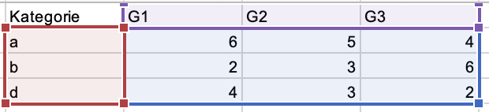{#fig-daten}

{#fig-barchart-mono-vis}

Gruppierte Datentabelle mit Balkendiagramm 
:::

Sollen einzelne Kategorien farblich hervorgehoben werden, dann müssen die Werte gruppiert organisiert werden, wobei jeder Wert in einer eigenen Gruppe geführt wird (@fig-barchart-multicolor). 

::: {#fig-barchart-multicolor layout-ncol=2 layout-valign="bottom"}

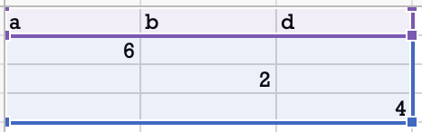{#fig-daten}

{#fig-barchart-mono-vis}

Datentabelle und Balkendiagramm mit farblich abgehobenen Kategorien.
:::

#### Darstellung optimieren

Bei der Darstellung von Balkendiagrammen verwendet Excel immer  Standardeinstellungen. Diese nutzen die Fläche des Diagramms nicht unbedingt optimal: Auf der Y-Achse wird immer eine Hauptbeschriftung oberhalb des grössten Wers eingefügt und die Abstände  zwischen den Balken sind grösser als die Balken (@fig-balken-mit-standard). 

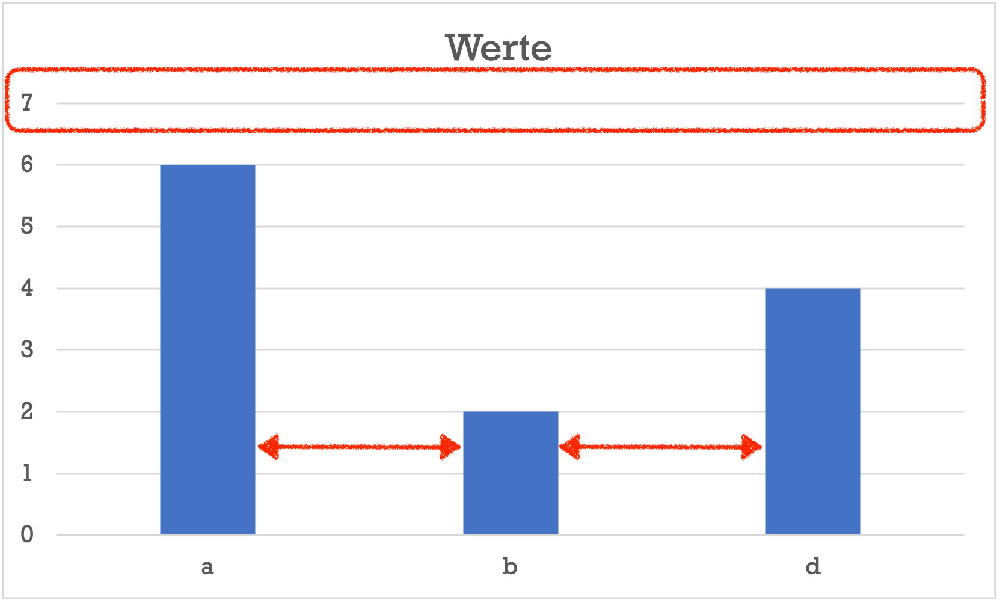{#fig-balken-mit-standard}

Die Y-Achse kann immer auf den Maximalwert begrenzt werden. Dazu wird die Achsbeschriftung mit der Maus ausgewählt. Anschliessend können in den Achsenoptionen die Grenzen der Y-Achse festgelegt werden. Hier sollte das Maximum auf den grössten dargestellten Wert gesetzt werden (s. @fig-achseneinstellungen).

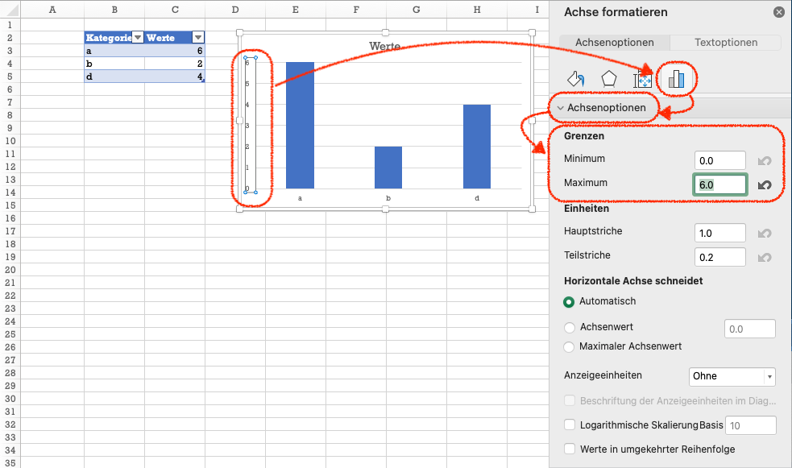{#fig-achseneinstellungen}

::: {.callout-note}
## Merke
Für Balkendiagramme sollte das Minimum der Y-Achse immer `0.0` sein.
:::

Die Abstände zwischen den Balken werden über die Formatierung der Balken gesteuert. Dazu muss ein Balken mit der Maus ausgewählt werden. Die einzige Einstellungskategorie für die Datenformatierung sind die `Reihenoptionen`, wo sich die beiden Einstellungen `Reihenüberlappungen` und `Abstandsbreite` finden (s. @fig-balken-abstaende).

{#fig-balken-abstaende}

@fig-balken-einstellungen-visualisierung zeigt die Bedeutung der beiden Optionen.

{#fig-balken-einstellungen-visualisierung}

Die Option `Reihenüberlappung` legt die Abstände ziwschen Balken in der gleichen Kategorie fest. Die Abstände werden in Prozent der Überlappung angegeben. 0% bedeutet keine Überlappung ohne Abstand. 100% bedeutet vollständige überlappung und -100% bedeutet einen Abstand einer Balkenbreite.

Die Option `Abstandsbreite` legt die Abstände zwischen den Kategorien fest. Die Abstände werden in Prozent der Balkenbreite angegeben.

::: {.callout-warning}
## Achtung

Die Überlappung und die Balkenbreite wird auch dann berücksichtigt, wenn ein Balken nicht dargestellt wird!
:::

Um farblich voneinander unterschiedene Kategorien mit gleicher Balkenbreite wie in @fig-barchart-multicolor zu erzeugen, muss die `Reihenüberlappung` auf `100%` gesetzt werden. Anschliessend können die Abstände mit der Option `Abstandsbreite` kontrolliert werden. @fig-barchart-multicolor verwendet eine `Abstandsbreite` von `10%`.

### Spezielle Balkendiagramme 

Excel bietet zwei spezielle Formen von Balkendiagrammen: *Trichterdiagramme* und *Wasserfall*-Diagramme. Beide Diagramme sind *eindimensional*. 

Trichterdiagramme stellen die Balken horizontal zentriert dar, wobei nur positive Werte zulässig sind. Deshalb haben Excels Trichterdiagramme *keine* Beschriftung der X-Achse (@fig-trichterdiagramm).

::: {.callout-note}
## Merke
Trichterdiagramme unterscheiden sich von anderen Balkendiagrammen nur in der Anordnung der Balken.
:::

{#fig-trichterdiagramm}

::: {.callout-tip}
## Praxis
Weil Trichterdiagrammen keine beschriftete X-Achse haben und die Anordnung der Balken schwerer zu dekodieren ist, sollten diese Diagramme **nicht** verwendet werden.
:::

Wasserfalldiagramme stellen die Balken so dar als Folge dar. Diese Diagramme stellen positive und negative Werte gerichtet nebeneinander. Der Start des von links nach rechts gelesenene nächste Balken beginnt bei dem Wert, an dem der vorherige Balken endete. Bei positiven Werten befindet sich der Endpunkt über dem Startpunkt, bei negativen Werten darunter (@fig-wasserfall-leserichtungen). 

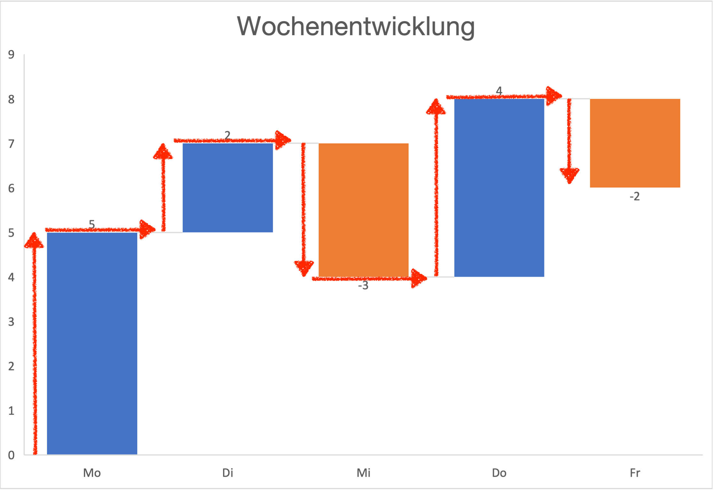{#fig-wasserfall-leserichtungen}

::: {.callout-note}
## Merke
Wasserfalldiagramme werden zur Visualisierung von Veränderungen über die Zeit verwendet.
:::

Bei Wasserfalldiagrammen kann die **Beschriftung** der X-Achse über ein zweite Datenspalte mitgegeben werden. Bei Trichterdiagrammen können auf die gleiche Weise die Beschriftungen der Y-Achse angepasst werden. In beiden Fällen müssen die Beschriftungen in der Spalte *vor* den Werten gespeichert sein.

### Histogramm

::: {.callout-note}
## Merke
Ein Histogramm ist eine Visualisierung der Werteverteilung als Balkendiagramm. 
:::

Histogramme visualisieren *kontinuierliche* bzw. metrischskalierte Wertebereiche, indem zwischen dem kleinsten und dem grössten Wert gleichmässige Intervalle gebildet werden und anschliessend die Anzahl der Werte in den Intervallen bestimmt wird.

::: {.callout-note}
## Merke
Für ein Excel-Histogramm müssen die Werte vor der Visualisierung **nicht** aggregiert werden.
:::

Ein Histogramm wird oft über einen Vektor erstellt. Werden die Daten so vorbereitet, dass unter den Werten keine anderen Daten stehen, dann kann die *gesamte Spalte* markiert werden, indem auf den Spaltenbuchstaben mit der Maus geklickt wird. Anschliessend kann das Histogramm in die Arbeitmappe eingefügt werden (@fig-histogramm-erstellen)

{#fig-histogramm-erstellen}

Ein Excel-Histogramm ist **immer** ein eindimensionales Balkendiagramm. Werden Werte aus mehreren Spalten übergeben, dann fliessen alle Werte in das Histogramm ein. 

#### Histogramme optimieren

::: {.callout-tip}
## Praxis
Im Gegensatz zu Balkendiagrammen wird die Y-Achse von Histogrammen in der Regel **nicht** angepasst.
::: 

Excel versucht die Intervalle für ein Histogramm aus dem vorliegenden Wertebereichen automatisch zu ermitteln. Dazu werden zwischen dem minimalen und maximalen Werten gleichgrosse Intervalle *proportional* zur Anzahl der Werte gewählt. Das bedeutet, dass Excel grössere Intervalle wählt, wenn weniger Werte vorhanden sind. Das ist nicht immer gewünscht oder die Intervallgrenzen liegen ungeeignet.

Die Intervalle eines Histogramms lassen sich über die Formatierung kontrollieren. Dazu wird mit der Maus ein Balken angeklickt und anschliessend die Datenreihenoptionen ausgewählt. 

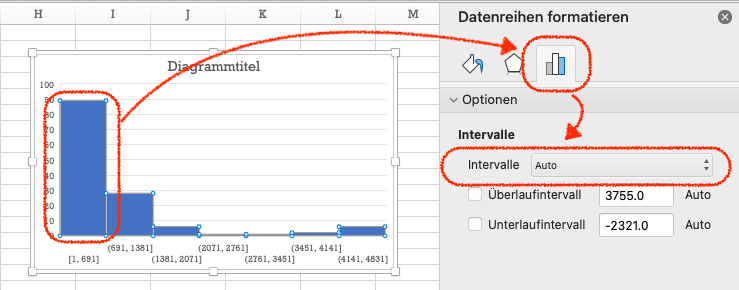{#fig-histogramm-konfigurieren}

Die Option `Intervalle` steht nach dem Erstellen des Histogramms auf `Auto`. Hier stehen die beiden Optionen `Invervallbreite` und `Anzahl der Intervalle` zur Auswahl. 

Mit `Intervallbreite` wird der **Abstand** zwischen zwei Intervallen angegeben (@fig-histo-breite). Die Intervallgrenzen werden durch den kleinsten und grössten Wert definiert. Wird beispielsweise die Intervallbreite mit 500 angegeben und der kleinste Wert ist 33, dann sind die Intervallgrenzen 33, 533, 1066 usw. Diese Grenzen sind nicht immer intuitiv, besonders wenn Histogramme zum Vergleich von Daten verwendet werden. Mit der Option `Unterlaufintervall` kann die erste Intervallgrenze festgelegt werden. Es bietet sich an, das Unterlaufintervall genauso breit zu machen, wie die Intervallbreite.

Mit `Anzahl der Intervalle` wird die Anzahl der Balken im Histogramm festgelegt (@fig-histo-anzahl). Excel berechent aus diesem Wert einen geeigneten Intervallabstand.

Die beiden Optionen `Überlaufintervall` und `Unterlaufintervall` ermöglichen es die Ober- bzw. Untergrenze der regulären Intervalle zu definieren. Die beiden Intervalle entsprechen dem ersten bzw. letzen Balken im Histogramm. Diese beiden Intervalle werden für die Intervallbreite **nicht** berücksichtigt, zählen aber zur Anzahl der Intervalle. Diese Intervalle können verwendet werden, wenn unterhalb der Grenze des Unterlaufintervalls bzw. oberhalb der Grenze des Überlaufintervalls vereinzelt "Ausreisser" mit grösseren Abständen als die Intervallbreite auftreten.

::: {#fig-histogramm-intervalle layout-ncol=2 layout-valign="bottom"}

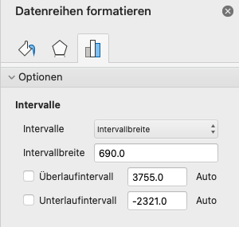{#fig-histo-breite}

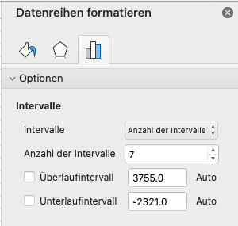{#fig-histo-anzahl}

Einstellungsmöglichkeiten für Histogrammintervalle
:::

::: {.callout-tip}
## Praxis
Für die erste Sichtung neuer Daten ist es leichter ein Histogramm über die Anzahl der Intervalle zu definieren. Wird anschliessend auf `Intervallbreite` gewechselt, zeigt Excel die verwendete Intervallbreite an. So lassen sich die Intervalle einfach feinjustieren.
:::

#### Histogramme für diskrete Daten

In der Datenreihenformatierung findet sich zusätzlich die Option `Nach Kategorie`, die keine weiteren Konfigurationsmöglichkeiten bietet. In diesem Fall akzeptiert Excel einen Vektor mit diskreten und einen mit numerischen Daten. Wird diese Option für die Intervalle gewählt, dann bilden die eindeutigen diskreten Daten Kategorien. Über diese Kategorien **summiert** Excel den numerischen Vektor, um die Höhe der Balken zu bestimmen. Das Ergebnis ist in den meisten Fällen kein Histogramm im eigentlichen Sinn, weil es eine Summe anstatt einer Anzahl anzeigt.

Wird als numerischer Vektor der Einsvektor (@sec-chapter-vektor-operationen)verwendet, dann entspricht die Summe der einzelnen Kategorien der Anzahl der Werte in der Kategorie. Ein solcher Einsvektor wird mit der @lst-einsvektor-cat erzeugt.

```{#lst-einsvektor-cat lst-cap="Einsvektor für Kategorien aus einer Tabelle"}
= 1 * (Tabelle1[disktrekeWerte] == Tabelle1[diskreteWerte])
```

Auf diese Weise lässt sich in Excel ein Histogramm für diskrete Daten erstellen (@fig-histo-diskret). 

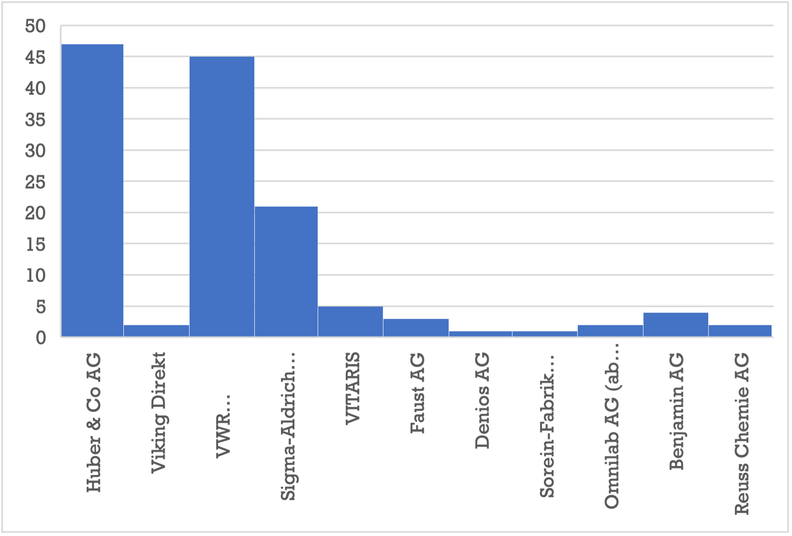{#fig-histo-diskret}

Im Fall von *nominalskalierten Werten* ist es oft wünschenswert die Balken in der Reihenfolge der Häufigkeiten zu organisieren. Das ist mit der Histogrammvisualisierung von Excel **nicht** möglich. Für solche Visualisierungen muss auf ein reguläres Balkendiagramm zurückgegriffen werden und die Daten vor der Darstellung entsprechend aufbereitet werden. 

### Boxplot


### Punktdiagramm

### Blasendiagramm

::: {.callout-note}
## Merke
Blasendiagramme sind Punktdiagramme mit drei dargestellten Merkmalen.
:::

Weil drei Merkmale kodiert werden, müssen die Daten in drei Spalten vorliegen. Dabei wird die linke Spalte für die X-Achse verwendet. Die mittlere Spalte wird für die Y-Achse verwendet. Die rechte Spalte enthält die Werte für die Grösse der Punkte. Prinzipiell lassen sich die Werte nachträglich noch umorganisieren, oft ist es aber einfacher, die Spalten vorher anzuordnen.  

{#fig-bubble-chart}

Eine Datenreihe eines Blasendiagramms besteht aus drei Merkmalen.

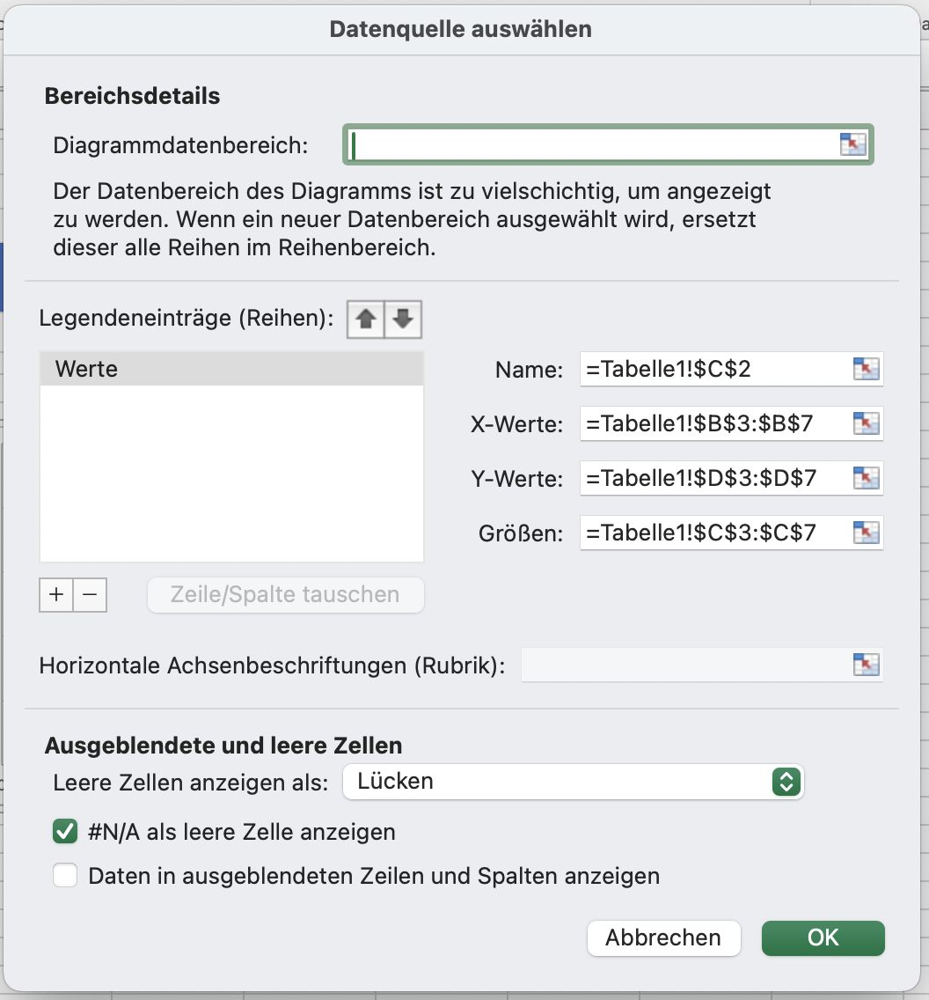{#fig-datenreihen-bubble-chart}

### Linien-, Kreis- und Donutdiagramme 

Linien-, Kreis- und Donutdiagramme sind in Excel Varianten von Balkendiagrammen: Sie verwenden das gleiche Format für die Datenreihen und werden ansonsten gleich konfiguriert. Wie bei Balkendiagrammen, wird die X-Achse als eine diskrete Datenskalierung behandelt. Die Daten können also nominal- oder ordinalskaliert sein. 

::: {.callout-tip}
## Praxis

Kreis- und Donutdiagramme sind identisch mit Balkendiagrammen, wenn alle Werte **positiv** sind. Für mehr als drei Werte können die meisten Menschen sich diese Diagramme oft nicht richtig interpretieren. Deshalb sollten Kreis- und Donutdiagramme möglichst nur zur Darstellung (extremer) Mengenverhältinisse verwendet werden. Grundsätzlich ist ein Balkendiagramm einem Kreis- oder Donutdiagramm vorzuziehen. (s. @fig-kreisdiagramm-aehnliche-groessen und @fig-balken-aus-kreisdiagramm)
:::

{#fig-kreisdiagramm-aehnliche-groessen}

{#fig-balken-aus-kreisdiagramm}

Excels **Liniendiagramme** zeichnen für jeden Wert auf der Y-Achse einen Punkt und verbinden die Punkte mit geraden Linien.

::: {.callout-warning}
## Achtung
Weil die X-Achse immer diskrete Daten abbildet, dürfen Liniendiagramme nicht mit Punktdiagrammen mit *interpolierten Linien* verwechselt werden. 
:::

::: {.callout-tip}
## Praxis
Excels Liniendiagramme sollten nur für sog. Paralleldiagramme verwendet werden, in denen mehrere diskrete Merkmale mit dem gleichen Wertebereich gegenübergestellt werden. Durch die Linien werden Unterschiede in den Ausprägungsprofilen sichtbar. 

@fig-parallel-plot zeigt ein solches Paralleldiagramm. Dieses Beispiel macht die Grenzen dieses Diagrammtyps sichbar, weil Excel sich überlagernde Linien nicht nebeneinander darstellen kann. 
:::

{#fig-parallel-plot}

Eine Variante von Paralleldiagrammen sind sog. Netzdiagramme (bzw. Spider-Web-Diagramme).

::: {.callout-note}
## Merke
Netzdiagramme ordnen die Kategorien der X-Achse sternförmig an. 
::: 

In Excel finden sich Netzdiagramme unter der Kategorie `Wasserfalldiagramme`. Diese Diagramme werden oft zum Vergleich von Merkmalsprofilen verwendet, z.B. als Ergänzung einer Stärken- und Schwächen-Analyse (SWOT-Analyse) 

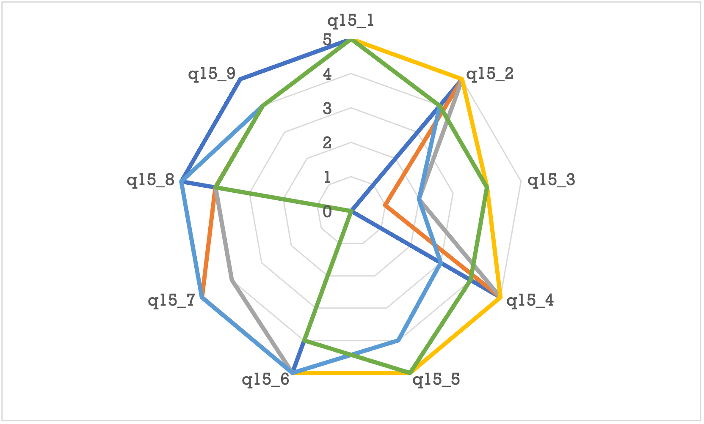{#fig-spiderweb-diagramm}

<!--
### Treemap-Diagramme
-->

## Mathematische Funktionen visualisieren

::: {.callout-note}
## Merke
Mathematische Funktionen werden immer über **Punktdiagramme** oder **Punkte mit interpolierten Linien** dargestellt.
::: 

Excel kann mathematische Funktionen nicht direkt visualisieren. Stattdessen müssen die Funktionen für einen gewünschten Wertebereich berechnet werden. Dazu werden Punkte auf der X-Achse ausgewählt und berechnet. Zwischen diesen Punkten berechnet Excel die Funktion nicht, sondern verbindet diese Punkte nur durch eine Linie. Diese Linie muss keine Gerade sein. Stattdessen versucht Excel eine Kurve so durch einen Punkt zu legen, sodass die Kurve keine Ecke hat. Die Folge dieses Verbinden von Punkten ist, dass je weniger Werte auf der X-Achse ausgewählt werden, desto ungenauer wird die Funktionsdarstellung.

Um eine mathematische Funktion mit Excel zu visualisieren, muss eine Wertetabelle erstellt werden. Diese Tablle wird in den folgenden Schritten erstellt. 

1. Die Unter- und Obergrenze des Darstellungsbereichs auf der X-Achse werden festgelegt. 
2. Aus diesen Intervallgrenzen wird die Differenz gebildet, woraus sich die Länge des Intervalls ergibt.
3. Die Anzahl der Punkte in diesem Intervall festgelegt. 
4. Die Länge des Intervalls wird durch die Anzahl der Punkte geteilt. Daraus ergibt sich der Abstand der Punkte im Intervall. 
5. Es wird eine ***Sequenz*** mit einer Länge der Anzahl der Punkte plus Eins gebiltet. Der Startwert dieser Sequenz ist die Untergrenze des Darstellungsbereichs. Die Schrittweite entspricht dem Abstand der Punkte Abstand der Punkte.
6. Die mathematische Funktion wird als Formel in die Spalte rechts neben der Sequenz eingegeben. Die Werte der Sequenz werden als Argumente der mathematischen Funktion verwendet.

::: {.callout-note}
Die Sequenz für die Wertetabelle muss die Anzahl der Punkte *plus Eins* enthalten, damit sowohl die Untergrenze als auch die Obergrenze des Darstellungsbereichs als Argumente verwendet werden. 
:::

Sollen mehrere Funktionen über das gleiche Intervall dargestellt werden, dann wird der letzte Schritt für jede zusätzliche Funktion wiederholt werden. Das Intervall der *Funktionsargumente* bildet immer die erste Wertespalte. Anschliessend wird die gesamte Wertetabelle visualisiert. 

Diese Wertetabelle kann als Punktdiagramm dargestellt werden. Dazu wird die gesamte Wertetabelle markiert und als **Punkte mit interpolierten Linien** visualisiert.  

{#fig-funktionen-visualisieren}